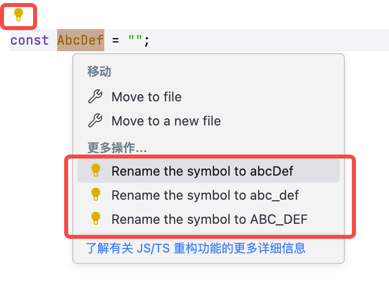

# String Converter VSCode Extension

[中文](./README_zh-CN.md)

This extension provides developers with efficient text processing tools, serving as an alternative to online services like https://jwt.io and https://www.epochconverter.com.

Core features include:

- Programming language literal parsing
- JWT token parsing
- Timestamp conversion
- Base64 decoding
- URL parsing
- JSON formatting

All features are deeply integrated into the IDE, displaying results through hover popups or side windows, with one-click copy capability for native IDE experience:

## Features

### Parse Programming Language Literals

Supports parsing literals from these programming languages:

- [x] Go
- [x] Java
- [x] JSON
- [x] Python
- [x] Rust
- [x] TypeScript / JavaScript
- [x] C/C++
- [x] JSX / TSX

More languages will be supported gradually. Contributions are welcome.

### Symbol style conversion

(Default CodeAction trigger, Hot Key `cmd+.`)

Supports intelligent identification of symbol styles and shows that the identifier can be converted to other styles (supports four styles: PascalCase, camelCase, snake_case, SCREAMING_SNAKE_CASE):

Supports copying and one-click renaming:

### JWT Token Parsing

### Timestamp Conversion

### Base64 Decoding

Detects Base64 content format and provides decoding results (Default CodeAction trigger, Hot Key `cmd+.`). 

- For string type: detects string encoding rules (supports UTF-8, GBK, etc.)

    

- For binary type: detects magic numbers and outputs in xxd-like format

   

### URL Parsing

Supports URL and query string parsing.

### JSON Formatting

### More Features

Additional features will be added as needed. Contributions are welcome.

### Trigger Way

Supports both Hover and Code Action triggers.

- Hover: Automatically triggered when you hover the mouse over the code.
- Code Action: Move the cursor to the corresponding code position, and after the light bulb appears, click the light bulb or press `cmd+.` to select the corresponding function to trigger.

The default trigger methods are as follows:

- Hover:
    - Parse programming language literals (string-literal)
    - JWT token parsing (jwt-parser)
    - Timestamp conversion (timestamp-parser)
    - URL parsing (url-parser)
    - JSON formatting (json-formater)
- Code Action:
    - Base64 decoding (base64-parser-text, base64-parser-binary)
    - Symbol style conversion (symbol-style-converter)

Custom trigger way, see below extension settings.

## Extension settings

- Can be configured through the following configuration items to customize the trigger way for features:

    - [`str-conv.trigger.codeAction`](vscode://settings/str-conv.trigger.codeAction) Configure whether a feature is enabled for Code Action trigger.
    - [`str-conv.trigger.hover`](vscode://settings/str-conv.trigger.hover) Configure whether a feature is enabled for Hover trigger.

## System Requirements

This extension is published as a Web Extension, supporting:
- Desktop
- Remote
- Browser
- VSCode Web

## Extension Settings

None currently.

Future updates may include converter toggles, priorities, and specific configurations based on demand.

## Known Issues

- Since no VSCode lexical tree-related API was found, this extension has to use the `prismjs` library as a code tokenizer. However, `prismjs` has weaker tokenizing capabilities and may cause parsing errors in some scenarios.

## Changelog

See: [CHANGELOG.md](CHANGELOG.md)