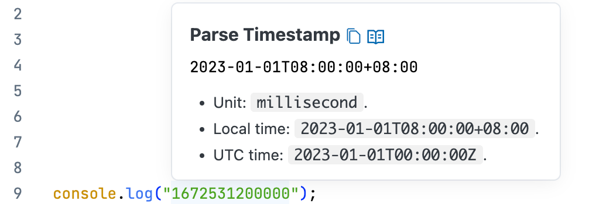

# String Converter VSCode Extension

[中文](./README_zh-CN.md)

This extension provides developers with efficient text processing tools, serving as an alternative to online services like https://jwt.io and https://www.epochconverter.com.

Core features include:

- Programming language literal parsing
- JWT token parsing
- Timestamp conversion
- Base64 decoding
- URL parsing
- JSON formatting

All features are deeply integrated into the IDE, displaying results through hover popups or side windows, with one-click copy capability for native IDE experience:

## Features

### Parse Programming Language Literals

Supports parsing literals from these programming languages:

- [x] Go
- [x] Java
- [x] JSON
- [x] Python
- [x] Rust
- [x] TypeScript / JavaScript

More languages will be supported gradually. Contributions are welcome.

### JWT Token Parsing

### Timestamp Conversion

### Base64 Decoding

Detects Base64 content format and provides decoding results.

- For string type: detects string encoding rules (supports UTF-8, GBK, etc.)

    

- For binary type: detects magic numbers and outputs in xxd-like format

   

### URL Parsing

Supports URL and query string parsing.

### JSON Formatting

### More Features

Additional features will be added as needed. Contributions are welcome.

## System Requirements

This extension is published as a Web Extension, supporting:
- Desktop
- Remote
- Browser
- VSCode Web

## Extension Settings

None currently.

Future updates may include converter toggles, priorities, and specific configurations based on demand.

## Known Issues

None currently.

## Changelog

See: [CHANGELOG.md](CHANGELOG.md)