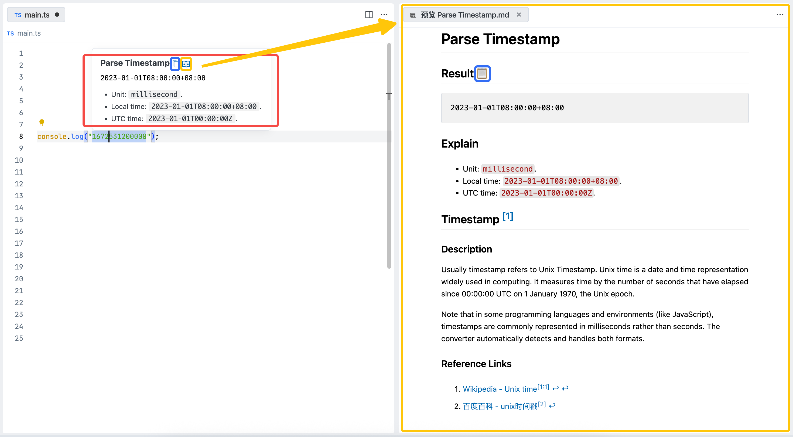
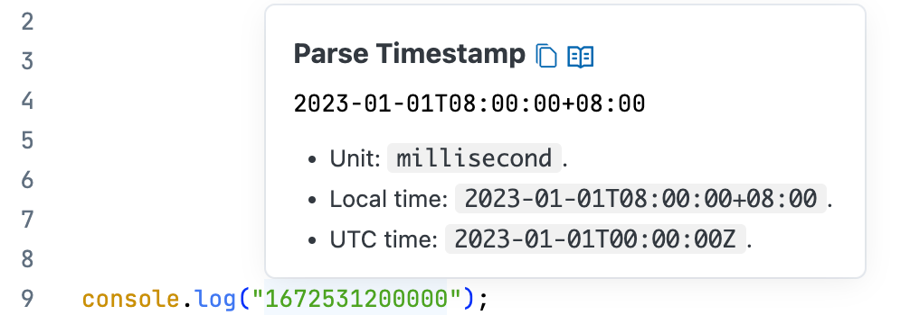

# String Converter VSCode 扩展

[English](README.md)

本扩展为开发者提供高效的文本处理工具，可替代在线服务如 https://jwt.io 和 https://www.epochconverter.com 等。

核心功能包括：

- 常见编程语言字面量解析
- JWT 令牌解析
- 时间戳转换
- Base64 解码
- URL 解析
- JSON 格式化

所有功能深度集成到 IDE，通过 Hover 弹窗 或 侧边窗口展示结果，并提供一键复制能力，提供原生 IDE 体验：

## 功能特性

### 解析编程语言的字面量

支持如下编程语言的字面量解析：

- [x] Go
- [x] Java
- [x] JSON
- [x] Python
- [x] Rust
- [x] TypeScript / JavaScript

后续会逐步支持更多编程语言，也欢迎贡献。

### JWT令牌解析

### 时间戳转换

### Base64 解码

探测 Base64 内容的格式，并提供解码结果。

- 针对字符串类型，探测字符串的编码规则，支持 UTF-8、GBK 等。

    

- 针对二进制类型，探测魔术，使用类似 xxd 的格式输出。

   

### URL 解析

支持 URL、 查询字符串 解析。

### JSON 格式化

### 更多功能

后续按需支持，也欢迎贡献。

## 系统要求

本扩展发布为 Web Extension，支持桌面、Remote、 Browser、VSCode Web。

## 扩展设置

暂无。

后续根据需求，可能提供转换器开关，优先级，特定配置等。

## 已知问题

暂无。

## 更新日志

参阅： [CHANGELOG.md](CHANGELOG.md)
