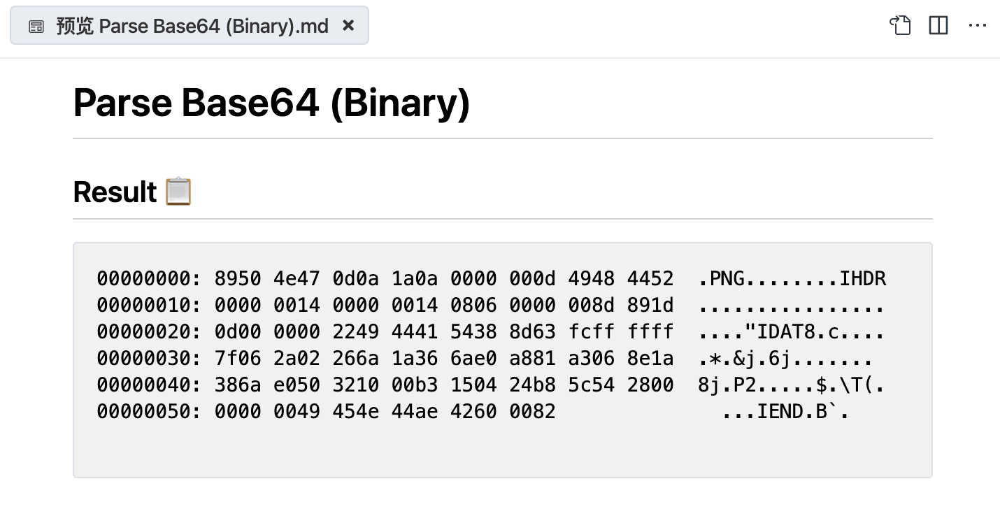
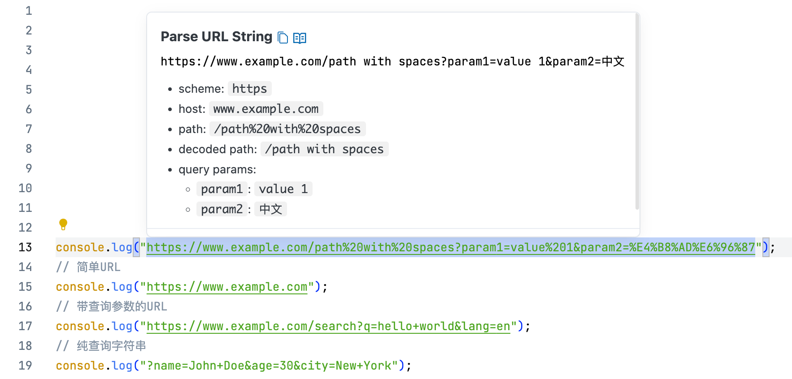

# String Converter VSCode 扩展

[English](README.md)

本扩展为开发者提供高效的文本处理工具，可替代在线服务如 https://jwt.io 和 https://www.epochconverter.com 等。

核心功能包括：

- 常见编程语言字面量解析
- JWT 令牌解析
- 时间戳转换
- Base64 解码
- URL 解析
- JSON 格式化

所有功能深度集成到 IDE，通过 Hover 弹窗 或 侧边窗口展示结果，并提供一键复制能力，提供原生 IDE 体验：

## 功能特性

### 解析编程语言的字面量

支持如下编程语言的字面量解析：

- [x] Go
- [x] Java
- [x] JSON
- [x] Python
- [x] Rust
- [x] TypeScript / JavaScript
- [x] C/C++
- [x] JSX / TSX

后续会逐步支持更多编程语言，也欢迎贡献。

### 符号风格样式转换

（默认 CodeAction 触发，即 `cmd+.`）

支持智能识别符号风格，并展示该标识符可以转换到其他风格（支持 PascalCase, camelCase, snake_case, SCREAMING_SNAKE_CASE 四种风格）：

支持复制和一键重命名：

### JWT令牌解析

### 时间戳转换

### Base64 解码

探测 Base64 内容的格式，并提供解码结果（默认 CodeAction 触发，即 `cmd+.`）。

- 针对字符串类型，探测字符串的编码规则，支持 UTF-8、GBK 等。

    

- 针对二进制类型，探测魔术，使用类似 xxd 的格式输出。

   

### URL 解析

支持 URL、 查询字符串 解析。

### JSON 格式化

### 更多功能

后续按需支持，也欢迎贡献。

## 触发方式

支持 Hover 和 Code Action 方式触发。

- Hover 方式： 鼠标悬停在代码上自动触发。
- Code Action： 将光标切换到对应代码位置，出现小灯泡后，点击小灯泡或按 `cmd+.`，选择对应功能后触发。

默认的触发方式如下所示：

- Hover:
    - 解析编程语言的字面量 (string-literal)
    - JWT 令牌解析 (jwt-parser)
    - 时间戳转换 (timestamp-parser)
    - URL 解析 (url-parser)
    - JSON 格式化 (json-formater)
- Code Action:
    - Base64 解码 (base64-parser-text, base64-parser-binary)
    - 符号风格样式转换 (symbol-style-converter)

自定义方式，参见下方扩展设置。

## 扩展设置

- 可以用过如下配置项自定义配置功能的触发方式：

    - [`str-conv.trigger.codeAction`](vscode://settings/str-conv.trigger.codeAction) 配置某个功能是否启用 Code Action 方式触发。
    - [`str-conv.trigger.hover`](vscode://settings/str-conv.trigger.hover) 配置某个功能是否启用 Hover 方式触发。

## 系统要求

本扩展发布为 Web Extension，支持桌面、Remote、 Browser、VSCode Web。

## 已知问题

暂无。

## 更新日志

参阅： [CHANGELOG.md](CHANGELOG.md)
